# chiba

**Same man, different mask.**

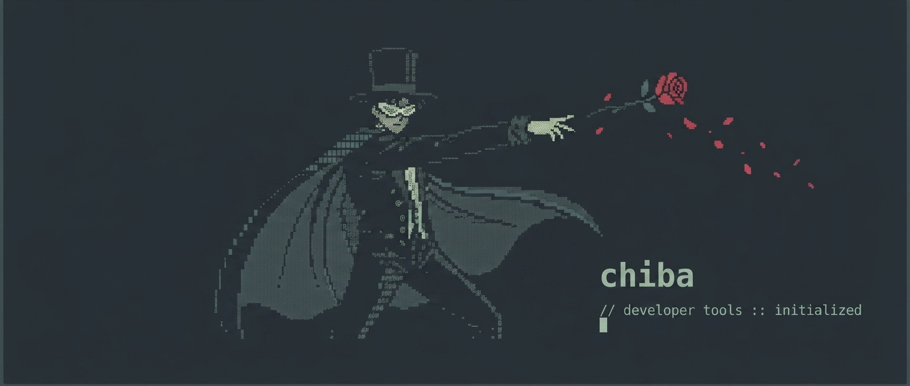

```text
~/notes $ chiba

   ██████ ██   ██ ██ ██████   █████
  ██      ██   ██ ██ ██   ██ ██   ██
  ██      ███████ ██ ██████  ███████
  ██      ██   ██ ██ ██   ██ ██   ██
   ██████ ██   ██ ██ ██████  ██   ██

  - [ ] a markdown-native fork of tuxedo          @terminal +rust
  - [x] fast, keyboard-driven, single binary      due:now
  - [ ] the bowtie gives way to the rose ────────➤ ✿
```

A fast, keyboard-driven terminal UI for markdown task lists.
Vim-style bindings, atomic writes, instant external-edit detection, and five
hand-tuned themes — all in a single static binary.

chiba is a markdown-native fork of
[tuxedo](https://github.com/webstonehq/tuxedo). Same UI, same natural-language
add, same CLI — but it reads and writes `- [ ]` checkboxes in a real markdown
file, and it never destroys the headings, prose, or code fences around them.

Tuxedo Mask is the disguise; Mamoru Chiba is the man underneath. tuxedo wears
todo.txt, chiba wears markdown, and the bowtie gives way to the rose he throws.

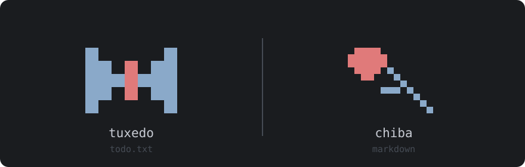

Not released yet — private while it gets a real shakedown. Build from a clone:

```sh
cargo install --path .
```

[](#license)
[](https://www.rust-lang.org)

The upstream [demo video](https://www.youtube.com/watch?v=mT1tg6SQ_Ag) by
[@IogaMaster](https://github.com/IogaMaster) still shows the UI accurately —
only the file format differs.

## Highlights

- **Pure markdown.** Tasks are ordinary `- [ ]` / `- [x]` lines. Headings, prose, code fences and front matter around them are carried through byte-for-byte — GitHub and Obsidian render the file as a checklist.
- **TUI and CLI in one binary.** Run `chiba` for the interactive UI, or `chiba <command>` for a [todo.txt-cli](https://github.com/todotxt/todo.txt-cli)-compatible command line (`add`, `ls`, `do`, `pri`, `archive`, …) — scriptable, with `--json` output and `$CHIBA_DIR` / `$CHIBA_FILE` / `$DONE_FILE` support (todo.txt-cli's `$TODO_*` vars work as fallbacks).
- **Natural-language add.** Type prose into the add prompt — `Pay rent monthly on the first, show 3 days before due, project home` — and chiba rewrites it to canonical form for you to review and save. Local, offline, no AI service.
- **Phone capture.** Press `s` for a QR pointing at a tiny PWA on your machine's LAN — type tasks from your phone and they appear in the list. Captures land in a sibling `inbox.md` first, so any tool that can append a line (shell, iOS Shortcuts, cron) is also a capture source.
- **Vim keys, no surprises.** `j` / `k` to move, `dd` to delete, `gg` / `G` to jump, `u` to undo (50 levels), chord prompts (`gg`, `dd`, `fp`, `fc`) with a 600 ms window.
- **Command palette.** `:` or `Ctrl-P` opens a fuzzy palette over every action — type a few letters, hit Enter. Same matcher as `/` search, ranked so start-of-label hits beat word-boundary hits beat mid-word hits.
- **Atomic, sync-friendly writes.** Every change goes through write-temp-then-rename. If another process — Dropbox, an editor, a script — modifies the file, chiba reloads on the next keypress (or within ~250 ms while idle) and flashes a notice.
- **Sibling-file archive.** `A` moves completed tasks to `done.md` next to your file, atomically.
- **Filter, sort, multi-select.** Cycle by `+project` or `@context`, sort by priority / due / file order, and bulk-complete or bulk-delete in visual mode.
- **Saved searches.** Name the active `/`-search with `fs`, then recall it any time by cycling saved filters with `ff`. Stored as plain `filter.<name>` lines in the config — hand-editable like everything else.
- **Five themes, three densities.** Cycle with `T` and `D`. Choices persist across runs and hot-reload when you edit `config.toml` externally.
- **No daemon, no database, no cloud.** One file in, one file out.

## Screens

| | |
| --- | --- |
| **Empty state** • thrown-rose mark and quick-start when the file has no tasks | 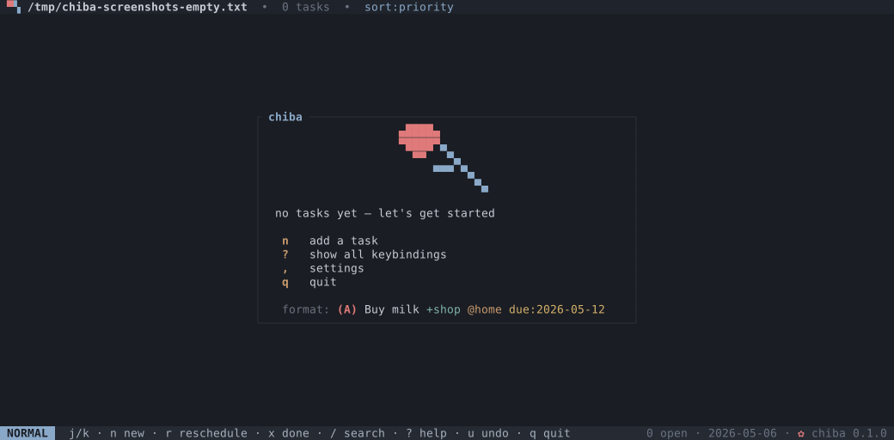 |
| **List** • list of todos, optionally grouped | 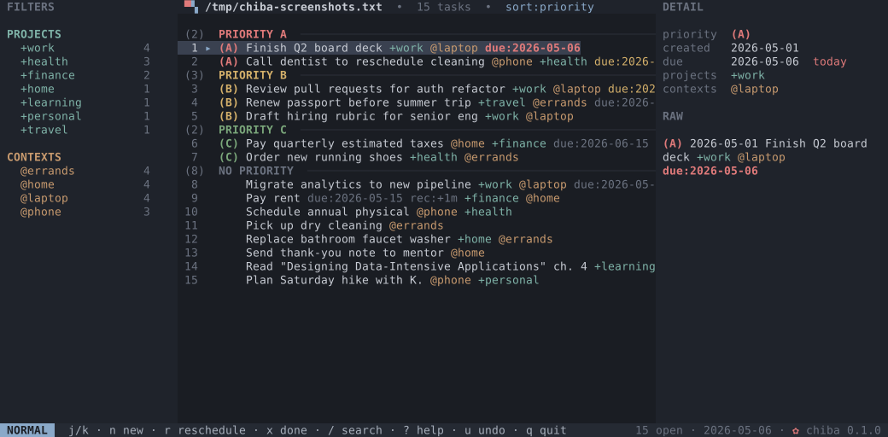 |
| **Archive** • completed tasks grouped by completion date | 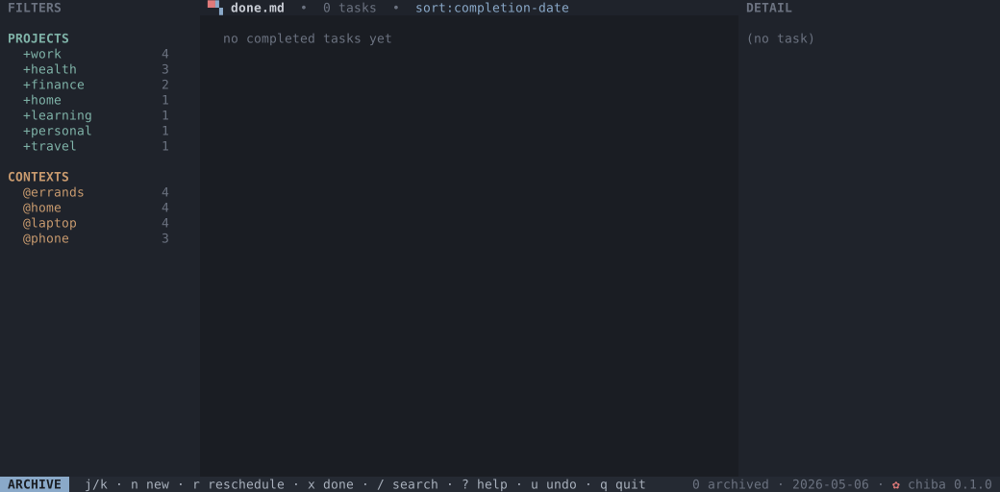 |
| **Filter sidebar active** • `fp` cycles projects with j/k, `fc` cycles contexts; saved searches list under a **SAVED** heading with live match counts | 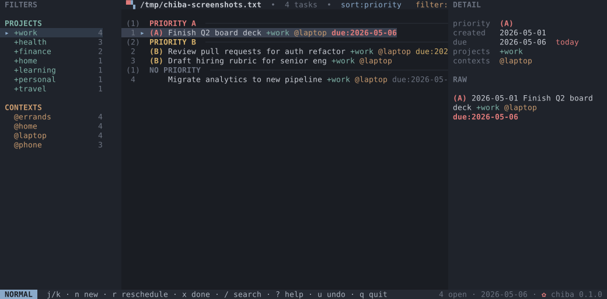 |
| **Command palette** • `:` or `Ctrl-P` opens a fuzzy palette over every action | 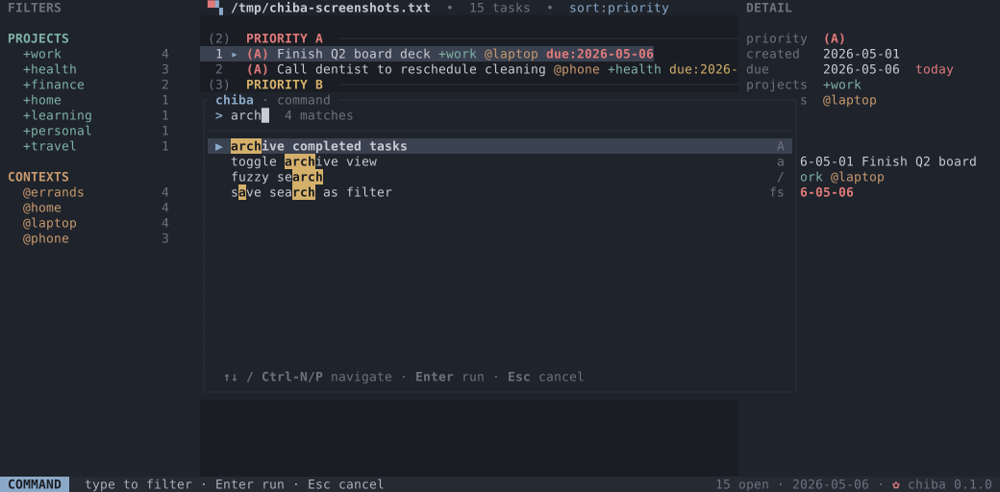 |
| **Help** • `?` opens the full keybindings overlay | 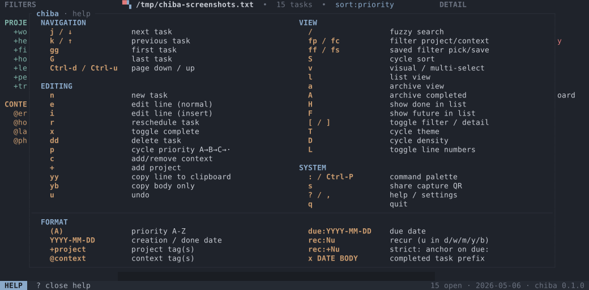 |

<details>
    <summary>How to generate the screenshots and demo</summary>
    <p>The screenshots in the table above are checked-in SVGs. Regenerate them with:</p>
    <pre>mise run screenshots</pre>
    <p>A demo GIF can be recorded with <a href="https://github.com/charmbracelet/vhs">vhs</a> from <code>docs/demo.tape</code>:</p>
    <pre>mise run demo</pre>
    <p>chiba ships without one — upstream's showed the bowtie and a todo.txt file, so it was dropped rather than left to mislead.</p>
</details>

## Themes

`T` opens a picker over five built-in themes, including Terminal, which respects your terminal palette.

| Muted Slate (default) | Dawn |
| --- | --- |
|  | 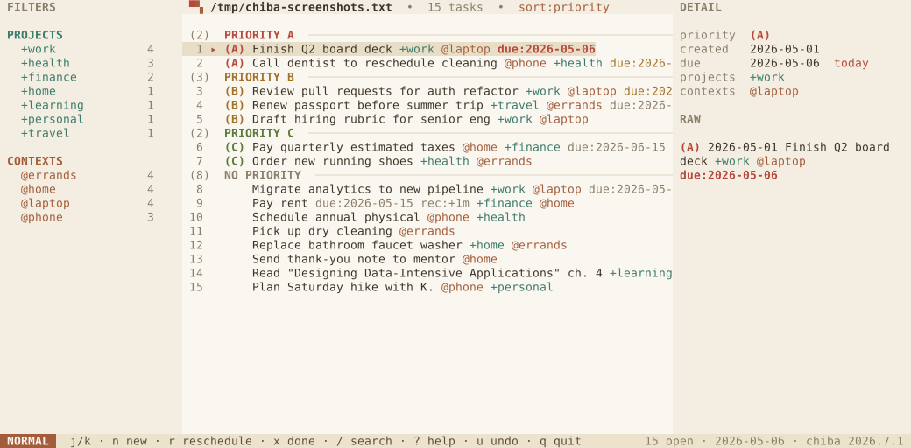 |
| **Nord** | **Matrix** |
| 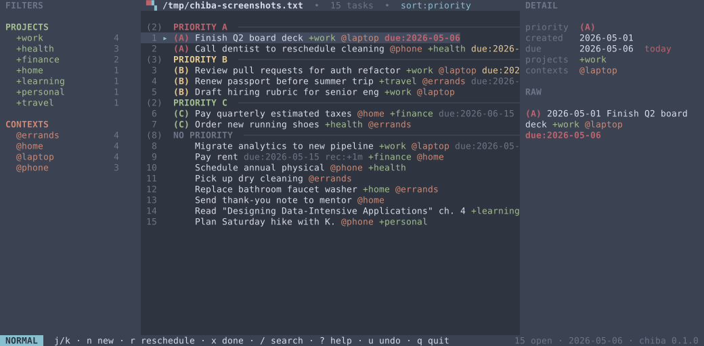 | 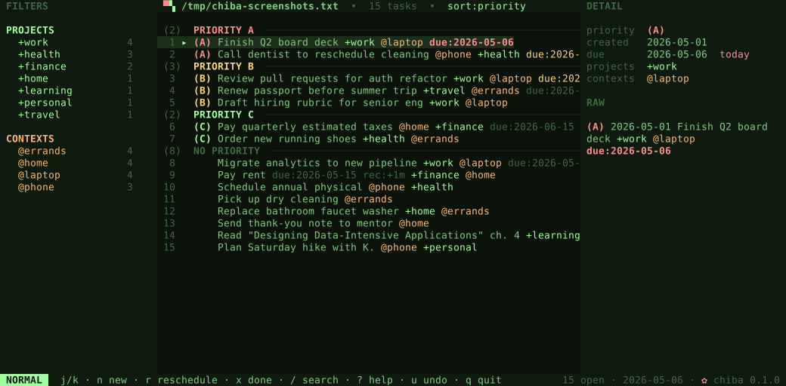 |

### Custom themes

Beyond the built-ins, chiba loads any `*.toml` file you drop in
`${XDG_CONFIG_HOME:-$HOME/.config}/chiba/themes/`. Each one joins the `T`
picker in sorted filename order. Ready-made themes live in
[`docs/themes/`](docs/themes) — copy one in and press `T`:

```sh
mkdir -p ~/.config/chiba/themes
curl -o ~/.config/chiba/themes/gruvbox-dark-soft.toml \
  https://raw.githubusercontent.com/dgnsrekt/chiba/main/docs/themes/gruvbox-dark-soft.toml
```

<details>
<summary>Theme file format and field reference</summary>

A theme file is one `key = value` per line. `name` is the label shown in the
picker; every other field is a color value. All fields are required: a file
missing one, carrying an unparseable color, or whose `name` collides with
another theme is skipped with a warning at startup.

**Color values** accept two forms:

- `#rrggbb` — a solid hex color (case-insensitive).
- `reset` or `transparent` — inherits the terminal emulator's own background
  color. Useful for `bg`, `panel`, and `statusbar` when you want your
  terminal's opacity, blur, or wallpaper to show through while keeping a
  custom text palette. Both keywords are case-insensitive and behave
  identically (same effect as the built-in **Terminal** theme).

| Field | Colors |
| --- | --- |
| `name` | label shown in the `T` picker (the only non-color field) |
| `bg` | window background |
| `panel` | filter and detail panel background |
| `border` | panel and modal borders |
| `fg` | primary text |
| `dim` | secondary / muted text |
| `accent` | logo, headings, hints, and selection markers |
| `cursor` | current row, and the highlighted row in the `T` picker |
| `selection` | set to the same value as `selected` |
| `statusbar` | status bar background |
| `status_fg` | status bar text |
| `mode_fg` / `mode_bg` | mode chip text / background |
| `pri_a` `pri_b` `pri_c` `pri_d` | priorities A through D |
| `pri_other` | priorities E through Z |
| `project` | `+project` tags |
| `context` | `@context` tags |
| `due` | `due:` date |
| `overdue` | past-due date |
| `today` | date due today |
| `done` | completed tasks |
| `selected` | selected-row background (visual mode) and the active filter |
| `matched` | search-match highlight |

</details>

## Install

### Homebrew (macOS, Linux)

```sh
brew install chiba
```

### Prebuilt binaries

Download the archive for your platform from the [latest release](https://github.com/dgnsrekt/chiba/releases/latest) and put `chiba` on your `PATH`.

Targets: `x86_64-unknown-linux-gnu`, `aarch64-unknown-linux-gnu`, `x86_64-apple-darwin`, `aarch64-apple-darwin`, `x86_64-pc-windows-msvc`. Each archive ships with a `.sha256` checksum.

### From source

```sh
cargo install --git https://github.com/dgnsrekt/chiba
```

Or clone and build:

```sh
git clone https://github.com/dgnsrekt/chiba
cd chiba
cargo build --release
./target/release/chiba [FILE]
```

Requires the Rust 2024 edition (recent stable toolchain).

## Usage

`chiba` is two things in one binary: an interactive TUI, and a one-shot
command line. With no subcommand it launches the TUI; with a recognized
subcommand it runs the [command line](#command-line-interface) and exits.

```sh
chiba [FILE]      # launch the TUI on FILE (created if missing)
chiba             # TUI on the default file (see resolution below)
chiba --sample    # open the bundled sample file in the temp dir
chiba <command>   # run a one-shot CLI command — see "Command-line interface"
chiba update      # print upgrade instructions for your install
chiba --help
chiba --version
```

When a newer release is available, the status bar shows `↑ <version> (chiba
update)` next to the version. The check runs in the background, is cached at
`$XDG_CACHE_HOME/chiba/latest_version.json` for 24 h, and fails silently
when offline. Set `TUXEDO_NO_UPDATE_CHECK=1` to disable.

### Which file chiba opens

Both the TUI and the CLI resolve the todo file the same way, in order:

1. An explicit `FILE` argument (TUI only).
2. `$CHIBA_FILE`, then `$TODO_FILE`, if set.
3. `$CHIBA_DIR/todo.md`, then `$TODO_DIR/todo.md`.
4. `./todo.md` in the current directory, if it exists.
5. Otherwise the TUI shows a first-run prompt — press `c` to create
   `./todo.md` here, or `s` to open a sample file in the system temp
   directory so you can poke around without committing to a path. (The
   one-shot CLI is non-interactive and uses the sample directly.)

The archive file is `$DONE_FILE` if set, otherwise a sibling `done.md` next
to the todo file. The file (and any missing parent directories) is created on
first use. The `TODO_*` fallbacks mean an existing todo.txt-cli `todo.cfg`
keeps working — it just points chiba at the same directory:

```sh
export CHIBA_DIR="$HOME/Documents/todo"
export CHIBA_FILE="$CHIBA_DIR/todo.md"
export DONE_FILE="$CHIBA_DIR/done.md"
```

Edits are persisted on every change via atomic write (write `.tmp`, rename).

If the file changes on disk (another editor, a sync client, a script),
chiba notices on the next keypress, or within ~250 ms while idle, and
reloads. The keystroke that triggered the reload is consumed — press it
again to act on the fresh state — and the status bar flashes a notice.

Pressing `A` appends every completed task to a sibling `done.md` and
removes them from the working file (atomically: `done.md` is written
before the originals are dropped). `a` toggles the archive view so you
can browse, un-archive, or permanently delete past tasks.

## Command-line interface

When the first argument is a recognized subcommand, chiba runs a one-shot
command instead of launching the TUI. The surface mirrors
[todo.txt-cli](https://github.com/todotxt/todo.txt-cli/wiki/Usage) — same
commands, aliases, task numbering, and output — so it's a drop-in for scripts
and aliases.

```sh
chiba add "Pay rent +home @bank due:2026-07-01"   # or: chiba a "..."
chiba ls @bank                                     # filter by context
chiba do 3                                          # mark task 3 complete
chiba pri 3 A                                        # set priority
chiba archive                                        # move done tasks to done.md
chiba ls --json | jq .                              # machine-readable output
```

| Command | Aliases | Arguments | Description |
| --- | --- | --- | --- |
| `add` | `a` | `TEXT...` | Add a task (natural-language dates supported, same as the `n` prompt). |
| `append` | `app` | `N TEXT...` | Append text to task `N`. |
| `prepend` | `prep` | `N TEXT...` | Prepend text to task `N`. |
| `replace` | | `N TEXT...` | Replace task `N` entirely. |
| `pri` | `p` | `N PRIORITY` | Set priority `A`–`Z` on task `N`. |
| `depri` | `dp` | `N...` | Remove priority from the given tasks. |
| `do` | `done`, `complete` | `N...` | Mark tasks complete (recurring tasks spawn their next instance). |
| `del` | `rm` | `N [TERM]` | Delete task `N`, or remove just `TERM` from it. Prompts unless `-f`. |
| `archive` | | | Move completed tasks to the done file. |
| `list` | `ls` | `[TERM...]` | List tasks. `TERM` is `+project`, `@context`, or free text. |
| `listall` | `lsa` | `[TERM...]` | List the todo file and the done file. |
| `listpri` | `lsp` | `[PRIORITY]` | List prioritized tasks (optionally a single priority). |
| `listproj` | `lsprj` | | List all `+projects`. |
| `listcon` | `lsc` | | List all `@contexts`. |

**Task numbers** are 1-based line numbers in the file, exactly as printed by
`list` — stable regardless of how the list is filtered or sorted. `list`
sorts by the full line (case-insensitive) and prints a `TODO: X of Y tasks
shown` footer, matching todo.txt-cli.

**Options:**

- `-f`, `--force` — skip confirmation prompts (e.g. for `del`).
- `--json` — emit machine-readable JSON instead of text. `list`-style commands
  print an array of task objects; mutating commands print a result object.
  No prompts or footers are written in this mode.

Global flags may appear before the subcommand (`chiba -f del 3`).

**Differences from todo.txt-cli:** `do` marks a task complete but does **not**
auto-archive it — completed tasks stay in the file until you run `archive` (or
press `A` in the TUI), matching chiba's interactive model. There is no `-d`
config-file flag; configure paths with the environment variables above.

## Keybindings

Custom normal-mode keybindings can be added in
`${XDG_CONFIG_HOME:-$HOME/.config}/chiba/keybinds.toml`:

The block below lists every rebindable action with the key it ships with —
copy it, then change the keys you care about and delete the rest (anything you
leave out keeps its default). A value is a single key or an array of
alternatives, e.g. `begin_add = ["N", "Ctrl-n"]`.

```toml
[normal]

# Navigation
cursor_down    = ["j", "Down"]
cursor_up      = ["k", "Up"]
cursor_top     = "gg"
cursor_bottom  = "G"
half_page_down = "Ctrl-d"
half_page_up   = "Ctrl-u"

# Editing
begin_add            = "n"
begin_edit           = "e"
begin_edit_insert    = "i"
toggle_complete      = "x"
delete               = "dd"
reschedule           = "r"
cycle_priority       = "p"
begin_prompt_context = "c"
copy_line            = "yy"
copy_body            = "yb"
undo                 = "u"
# begin_prompt_project defaults to "+", which can't be written here (the
# parser reads "+" as a modifier separator). Pick another key to move it, e.g.
# begin_prompt_project = "P"

# Filtering, sort, view
begin_search        = "/"
arm_f               = "f"        # leader for the fp / fc / ff / fs chords
pick_project        = "fp"
pick_context        = "fc"
pick_saved_filter   = "ff"
save_current_filter = "fs"
cycle_sort          = "S"
toggle_visual       = "v"
toggle_selected     = "space"
go_list             = "l"
toggle_archive_view = "a"
archive_completed   = "A"
toggle_show_done    = "H"
toggle_show_future  = "F"

# Layout & theme
toggle_left_pane  = "["
toggle_right_pane = "]"
open_theme_picker = "T"
cycle_density     = "D"
toggle_line_num   = "L"
# cycle_theme has no default — bind a key to cycle themes without the picker:
# cycle_theme = "Ctrl-t"

# System
open_command_palette = [":", "Ctrl-P"]
open_share           = "s"
open_help            = "?"
open_settings        = ","
escape_stack         = "Esc"
quit                 = "q"
```

Custom bindings are checked before the defaults. The default bindings remain
available unless the same key or two-key chord is bound to another action in
the file. Action names are snake_case, matching the names in the command
palette where possible: `toggle_complete`, `pick_project`,
`open_theme_picker`, and so on. Key names can be single characters, two-key
chords like `ZZ`, modifier forms like `Ctrl-n` / `Alt-x`, named keys like
`Esc`, `Enter`, `Tab`, arrows, `Page-Up`, `Page-Down`, or `F1` through `F24`.

### Navigation

| Key | Action |
| --- | --- |
| `j` / `↓` | next task |
| `k` / `↑` | previous task |
| `gg` | first task |
| `G` | last task |
| `Ctrl-d` / `Ctrl-u` | half-page down / up |

### Editing

| Key | Action |
| --- | --- |
| `n` | add task |
| `e` | edit current task in Normal mode (see [Edit dialog](#edit-dialog)) |
| `i` | edit current task in Insert mode (see [Edit dialog](#edit-dialog)) |
| `x` | toggle complete |
| `dd` | delete task |
| `p` | cycle priority A → B → C → · |
| `c` | add or remove a context |
| `+` | add a project |
| `yy` | copy current line to clipboard |
| `yb` | copy current body only (no priority, dates, projects, contexts, `key:value`) |
| `u` | undo (50 levels) |

### Edit dialog

The edit dialog uses vim-style modal editing. Press `i` to edit the current task
starting in **Insert mode** — start typing immediately. Press `e` to start in
**Normal mode** so you can navigate before changing anything. The add prompt
(`n`) also opens directly in Insert mode.

The modal keys below apply in Normal mode:

| Key | Action |
| --- | --- |
| `h` / `←` | move cursor left |
| `l` / `→` | move cursor right |
| `w` | jump to start of next word |
| `b` | jump to start of previous word |
| `e` | jump to end of current word |
| `x` | delete character under cursor |
| `dw` | delete to start of next word |
| `cw` | delete to start of next word and enter Insert mode |
| `i` | enter Insert mode before cursor |
| `a` | enter Insert mode after cursor |
| `A` | enter Insert mode at end of line |
| `Esc` (in Insert) | return to Normal mode |
| `Esc` (in Normal) | cancel and close |
| `Enter` (in Insert and Normal) | save |

### Filtering, sort, view

| Key | Action |
| --- | --- |
| `/` | search |
| `fp` | filter by project (`j` / `k` cycles, `Esc` clears) |
| `fc` | filter by context (`j` / `k` cycles, `Esc` clears) |
| `ff` | pick a saved search (`j` / `k` cycles, `Enter` keeps, `Esc` reverts) |
| `fs` | save the active `/`-search as a named filter |
| `S` | cycle sort: priority → due → file order |
| `v` | enter visual / multi-select; `space` toggles a row |
| `x` / `dd` (in visual) | bulk-complete / bulk-delete the selection |
| `l` | list (default) view |
| `a` | toggle archive view |
| `A` | archive completed tasks → `done.md` |
| `H` | toggle showing done tasks in the main list |
| `o` | open the current task's existing `note:<path>` in `$VISUAL` / `$EDITOR` |
| `O` | create the current task's note if needed, then open it |

### Layout & theme

| Key | Action |
| --- | --- |
| `[` | toggle filter sidebar |
| `]` | toggle detail sidebar |
| `T` | open theme picker |
| `D` | cycle density: compact → comfortable → cozy |
| `L` | toggle line numbers |

### System

| Key | Action |
| --- | --- |
| `:` / `Ctrl-P` | command palette |
| `s` | share capture QR (phone PWA) |
| `?` | help overlay |
| `,` | settings overlay |
| `q` | quit |

Two-key chord prompts (`gg`, `dd`, `yy`, `yb`, `fp`, `fc`, `ff`, `fs`) show
a `g…` / `d…` / `y…` / `f…` indicator in the status-bar mode chip while the
leader is armed; the window is 600 ms.

Copy uses the OSC 52 terminal escape, so it works locally and over SSH on
any terminal that supports it (kitty, alacritty, wezterm, iTerm2, foot,
modern xterm; tmux when `set -g set-clipboard on`). Older terminals will
silently ignore the keystroke.

## File format

A chiba file is markdown. Tasks are checkbox list items; everything else is
left alone.

```markdown
# Work

Notes, headings, and code fences are carried through untouched.

- [ ] (A) 2026-04-28 Call dentist @phone +health due:2026-05-08
- [x] 2026-05-05 2026-05-01 Submit expense report +work
- [ ] Pay rent due:2026-05-15 rec:+1m t:-3d
```

A line is a task when it matches `<bullet> [ ] <body>` — bullet `-`, `*` or
`+`, box `[ ]`, `[x]` or `[X]`. Any other line (heading, prose, blank, fenced
code, front matter, ordered list, blockquote) is **passthrough**: chiba stores
it verbatim and writes it back byte-for-byte. A `- [ ]` inside a fenced code
block is not a task.

Leading indentation is preserved but carries no meaning — chiba-flat has no
subtasks. Nesting is a separate design — see
[`docs/design/spec-vault.md`](docs/design/spec-vault.md).

The body after the checkbox is todo.txt, unchanged:

- `(A)` — priority, A through Z (omit for none)
- `2026-04-28` — creation date in ISO 8601
- `+project` — project tag
- `@context` — context tag
- `key:value` — extension; `due:YYYY-MM-DD` is recognized for sort and
  due-bucket grouping in the list view. `note:<path>` is recognized by the
  note actions (`o` / `O`): relative paths resolve under `notes_dir`, then
  `$NOTES_DIR`, then `~/notes`. Keys you'd rather not see can be hidden from
  the rows via [`hide_keys`](#hiding-keyvalue-tags)
- `#tag` — also a context, the markdown-native spelling of `@context`.
  Both forms round-trip as written; chiba never rewrites one into the other
- `rec:[+]N{d,b,w,m,y}` — recurrence; on completion, chiba inserts
  a fresh copy of the task with `due:` advanced by `N` days, business
  days (Mon–Fri), weeks, months, or years. The `+` prefix means
  *strict* recurrence anchored to the previous due date (e.g.
  `rec:+1m` for monthly rent on the 15th); without it, the new due is
  computed from the completion date (e.g. `rec:1w` for "water plants
  one week after I last did").

Completion lives in the checkbox, not in the body. A completed task carries
its completion date first, then its creation date:

```markdown
- [x] 2026-05-05 2026-05-01 Submit expense report +work
```

Recurring example:

```markdown
- [ ] 2026-05-09 Pay rent due:2026-05-15 rec:+1m
```

Pressing `x` on the line above marks the original complete *and* inserts
`- [ ] 2026-05-09 Pay rent due:2026-06-15 rec:+1m`. `u` undoes both at once.

### Coming from todo.txt

```sh
chiba migrate --dry-run   # show exactly what would change
chiba migrate             # todo/done/inbox .txt -> .md
```

Migration converts the whole **set** — `todo`, `done` and `inbox` together.
Converting the task file alone would leave your archive behind, which reads as
"my history vanished".

Nothing is written until every file has been converted in memory *and* verified
by round-tripping the result back through the opposite converter. A conversion
that can't prove itself lossless touches nothing:

```
  todo.txt → todo.md — 3 tasks, todo.txt.bak kept
  done.txt → done.md — 1 task, done.txt.bak kept
  inbox.txt → inbox.md (moved; capture spool, not task lines)

converted 4 tasks in ~/notes
verified: round-trips back to todo.txt byte-identically
```

Your originals are kept as `.bak` — migration never deletes and never
overwrites an existing backup. Running it twice is a no-op.

The inbox is *moved*, not converted: its lines are natural language awaiting
the capture pipeline, not tasks, so wrapping them in checkboxes would be wrong.

### Going back

```sh
chiba eject --dry-run
chiba eject               # todo/done/inbox .md -> .txt
```

`eject` hands the directory back to todo.txt-cli or tuxedo. It's lossy by
nature — todo.txt has nowhere to put a heading — so it reports how many
non-task lines it couldn't carry, and they survive in `todo.md.bak`.

For single files rather than a directory, `chiba import SRC [DST]` and
`chiba export SRC [DST]` do one conversion with no renaming.

### If both files exist

chiba uses `todo.md` and ignores `todo.txt`, which means the two silently
drift. It says so on every run, and `chiba migrate` prints the breakdown:

```
  todo.md   3 tasks
  todo.txt  2 tasks
  todo.md is newer
  2 task(s) only in todo.md, 1 only in todo.txt
```

This usually means a synced folder is shared with a machine still running
tuxedo. Pick one source of truth — move the loser aside as `.bak`.

chiba reads `$CHIBA_FILE` / `$CHIBA_DIR`, falling back to `$TODO_FILE` /
`$TODO_DIR`, so an existing todo.txt-cli environment keeps pointing at the same
directory.

## Natural-language add

Press `n` to open the add prompt. Type the task in plain English. When the
buffer contains recognized phrases (dates, weekdays, recurrence, project /
context names, priority), pressing Enter rewrites the draft into canonical
form — review or tweak it, then Enter again to save.

| What you type | What lands in the draft |
| --- | --- |
| `Pay rent monthly on the first of the month, show the todo 3 days before the due date. It's part of project home and context bank` | `Pay rent +home @bank due:2026-06-01 rec:+1m t:-3d` |
| `Buy milk tomorrow` | `Buy milk due:2026-05-12` |
| `Call mom every week starting Friday for project family` | `Call mom +family due:2026-05-15 rec:+1w` |
| `Submit timesheet every other friday show 1 day before` | `Submit timesheet due:2026-05-15 rec:+2w t:-1d` |
| `Daily standup high priority` | `(A) standup rec:+1d` |
| `Annual review April 15 +work @office` | `Annual review +work @office due:2027-04-15` |

Recognized vocabulary:

- **Dates** — `today`, `tonight`, `tomorrow`, `yesterday`, weekdays (`monday` / `mon` …), months (`april 15`, `15th of april`), `in 3 days`, `the first of the month`, ISO `2026-05-15`.
- **Recurrence** — `daily`, `weekly`, `biweekly`, `monthly`, `yearly`, `annually`, `every monday`, `every 2 weeks`, `every other friday`, `every business day`.
- **Threshold** — `show 3 days before due`, `2 weeks before due`.
- **Projects / contexts** — prose form `project home` and `context bank`, or the standard `+home` / `@bank` sigils.
- **Priority** — `high priority` → A, `medium priority` → B, `low priority` → C, or `priority A`.

Parsing is rule-based and runs locally — no network calls, no API key. If
the buffer already contains a `due:`, `rec:`, or `t:` token, chiba assumes
you've typed canonical form and saves it directly on the first Enter.

## Phone capture

Press `s` to start a tiny capture server on your machine's LAN address and
display a QR code for it. Scan it from your phone — any modern browser — to
get a minimal PWA you can install to your home screen. Type a task, tap
Add, and within a tick it shows up in your task list.

Captures never touch `todo.md` directly. They land in a sibling
`inbox.md`, which chiba drains on every external-change poll: each line
is run through the same natural-language pipeline as the `n` add prompt,
given a creation date if missing, wrapped in a checkbox, and merged into
`todo.md` as a single undoable batch (`u` rolls back the whole drain at once).

That makes `inbox.md` a general capture endpoint, not just a PWA backend.
Lines you append there are plain text, not markdown — chiba adds the `- [ ]`.
Anything that can append a line works as a producer:

```sh
echo "Refill prescription tomorrow" >> ~/notes/inbox.md
echo "Call dentist due:2026-06-01" >> ~/notes/inbox.md
```

Shell aliases, iOS Shortcuts writing to a synced folder, cron jobs,
email-to-file gateways — pick your producer. As long as it appends a line
to the sibling `inbox.md`, chiba picks it up.

The server:

- Binds on first `s` press and stays up for the rest of the session.
  Subsequent `s` presses just re-show the QR; any key dismisses the
  overlay.
- Listens on `0.0.0.0:<port>` so phones on the same WiFi can reach it.
  The port is OS-assigned on first use and persisted to `config.toml` so
  phone bookmarks survive across sessions.
- Gates every protected route on a 64-character hex token baked into the
  URL path. The token is generated once, persisted to `config.toml`, and
  compared in constant time.
- Speaks plain HTTP — **trusted networks only.** On a shared or public
  WiFi anyone passive-sniffing can recover the token. To rotate, delete
  `share_token` from `config.toml` and press `s` again.

Drains from chiba-managed producers are crash-safe: the capture server
holds the same advisory lock as the TUI's rename-and-merge, and any
staging file left over from an interrupted drain is replayed on the
next session. Plain shell appends are useful for lightweight capture,
but they do not take that lock; use the capture server or the same lock
if a producer must be serialized with the TUI drain.

## Configuration

Persisted to `${XDG_CONFIG_HOME:-$HOME/.config}/chiba/config.toml`. Cycling
theme, density, or sort, and toggling sidebars / line-numbers / done-visibility
all update the file. Unknown keys are ignored, so older binaries don't break
on newer files.

**Hot-reload.** Edits to `config.toml` are picked up while the TUI is running —
change the theme, density, sort, layout, saved filters, or any other field and
the UI updates within ~200 ms. Parse failures (e.g. a typo mid-edit) leave the
running config intact and flash a warning in the status bar.

Two additional keys, `share_token` and `share_port`, are written by the
[phone capture](#phone-capture) server on first use. Treat `share_token`
as a secret — anyone who has the value and LAN reach can append to your
inbox. Delete the key from `config.toml` to rotate it on the next `s`
press.

Saved searches (created with `fs`) are written one per line as
`filter.<name> = <query>`, where `<query>` is the `/`-search needle. They
round-trip as plain text, so you can add, rename, or delete them by editing
`config.toml` directly; a repeated `filter.<name>` keeps the last value, and
`<name>` may not contain `=`.

Task-note actions resolve relative `note:<path>` tokens under `notes_dir`.
If `notes_dir` is not set, chiba falls back to `$NOTES_DIR` and then
`~/notes`. `O` creates missing notes under `projects/chiba-tasks/` using a
small Markdown template and appends the generated `note:<path>` token to the
task; `o` only opens an existing linked note.

```toml
notes_dir = ~/notes
```

### Hiding `key:value` tags

Some `key:value` extensions are for machines, not eyes — e.g. a `uid:` you
sync against. Add a comma-separated `hide_keys` line to `config.toml` and
those keys' tokens are dropped from the task rows (list and archive views):

```toml
hide_keys = uid, sync
```

Matching is case-insensitive. Hiding is purely visual — the tags stay on
disk untouched, still serialize, and still show in the detail pane's **RAW**
section (a deliberate escape hatch). Searches still match hidden text; the
hidden characters just aren't drawn.

## Development

```sh
mise run fmt      # cargo fmt --all
mise run clippy   # cargo clippy --all-targets --locked -- -D warnings
mise run test     # cargo test --locked
```

CI runs all three on every push and pull request. Tasks are also runnable as
plain `cargo` commands if you don't use [mise](https://mise.jdx.dev/).

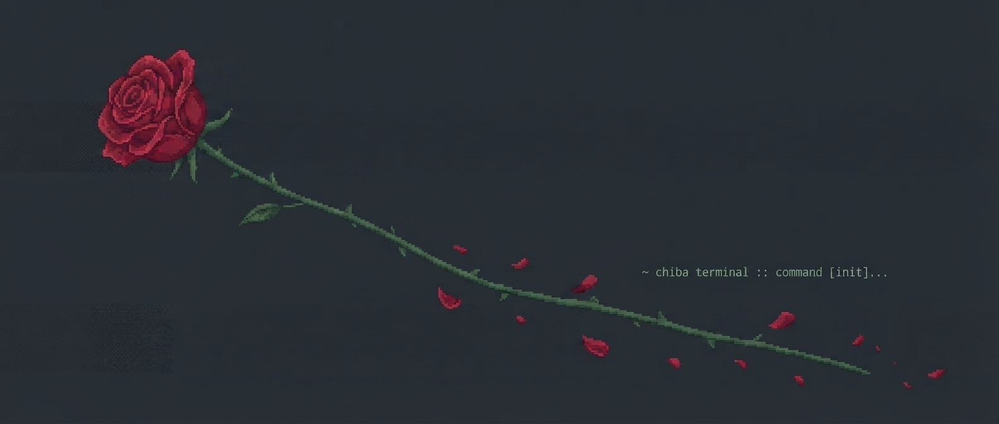

## Acknowledgments

- [tuxedo](https://github.com/webstonehq/tuxedo) by Webstone — chiba is a fork of it; the UI, the natural-language parser, and the CLI are all theirs.
- [todo.txt](http://todotxt.org/) by Gina Trapani — the task grammar chiba still uses inside each checkbox.
- [ratatui](https://ratatui.rs/) and [crossterm](https://github.com/crossterm-rs/crossterm) — the rendering and terminal-input crates chiba is built on.

## herdr

If you run chiba inside [herdr](https://github.com/herdrdev/herdr), a pane that
was running chiba comes back as a plain shell after a herdr restart — herdr only
relaunches programs for its own built-in agent list.

```sh
chiba integration herdr     # install the plugin
chiba integration status    # check it
```

chiba then leaves a marker while it runs, and a small herdr plugin types `chiba`
back into those panes from its `[[startup]]` hook once herdr has restored the
session. Quitting chiba removes the marker, so a pane you deliberately closed
stays closed; a pane killed by the restart comes back.

Removal is `chiba integration herdr --uninstall`. Everything lives in
`~/.config/chiba/herdr/` and is registered with `herdr plugin link` — chiba never
edits herdr's own config.

*Naming note: this installs a herdr **plugin**. herdr's `integration install`
list is a closed set of AI agents that chiba can't join without patching herdr;
its plugin system is the part open to third parties.*

### Where completed tasks go

```toml
archive_mode = file       # default: `A` moves them to a sibling done.md
archive_mode = in_place   # they stay in todo.md, hidden by the done filter
```

Under `in_place`, `A` writes nothing and says so — completed tasks keep their
`- [x]` line where it is, under the heading that gave it meaning. `H` shows
them in the main list; `a` lists them on their own, sourced from your file
rather than from `done.md`.

This is direction B's default, offered now so adopting the vault design later
isn't a change in behaviour you have to relearn. `file` stays the default and
behaves exactly as before.

## Staying current with tuxedo

chiba is a fork, so upstream's fixes are chiba's fixes. Two scripts keep that
from turning into a project:

```sh
./scripts/upstream-status.sh   # how far behind, and which files will conflict
./scripts/upstream-merge.sh    # merge, test, then audit the merge
```

The merge script runs `scripts/rename-audit.py` on whatever just landed. A
fork rename is safe for identifiers and paths and *unsafe* for every sentence
that explains the fork — "recurrence is a chiba feature" was one such line,
and it compiled, passed 499 tests, and read as authoritative while being
false. The audit lists renamed prose so it gets read by a human once, at the
only moment it's cheap.

## Design

How chiba's document model works and why, plus the fork's decision record:

- [`docs/design/spec-flat.md`](docs/design/spec-flat.md) — what chiba is: one
  markdown file, prose preserved, anchoring rules
- [`docs/design/spec-vault.md`](docs/design/spec-vault.md) — the multi-file
  vault design that was *not* built, and why
- [`docs/design/directions.md`](docs/design/directions.md) — the decision
  between the two

## Roadmap

Planned and in-flight work lives in [`todo.md`](./todo.md) — eat your own dog food.

## Contributing

Issues and pull requests are welcome. For larger changes, please open an
issue first to discuss the approach. Run `mise run fmt clippy test` (or the
plain cargo equivalents) before submitting.

## License

Released under the [MIT License](https://opensource.org/licenses/MIT).
